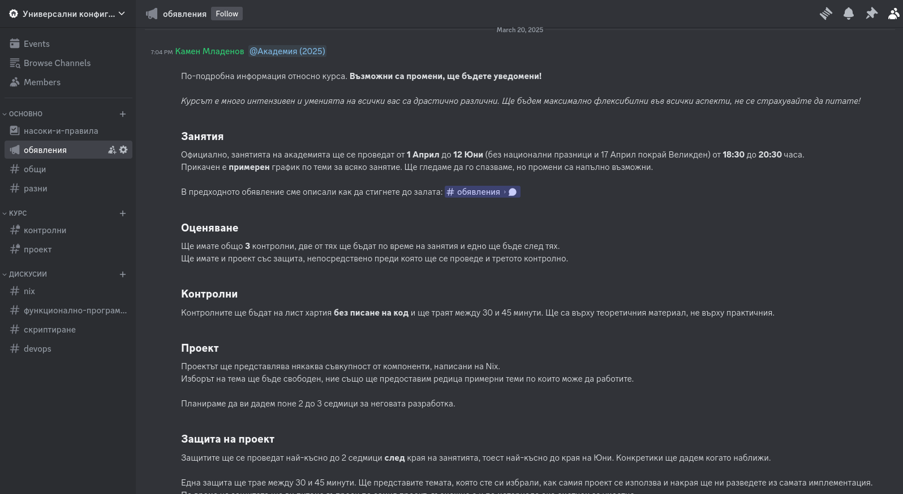

# Добре дошли!

## Кои сме ние?

Павел Атанасов - завършил бакалавър СИ @ ФМИ

Камен Младенов - 4ти курс бакалавър КН @ ФМИ

## Какво ще учим в този избираем курс?

- Система за възпроизводимо изпълнение на *рецепти*:

  - настройка (конфигурация) на програма

  - скрипт за компилиране на програма

  - среди за разработка

  - системни сървиси

  - цели системни конфигурации

## Текущата методика с рецепти

1. Намираме упътване/скрипт/... *някъде* в интернет

2. Разплитаме цялата дискусия/пост

3. Ръчно изпълняваме описаните инструкции

4. (Много често) някоя стъпка е грешна/outdated/невалидна за текущата система/...

   - Някакви програми трябва да бъдат инсталирани
   - Някакви файлове не съществуват (вече)
   - Версията на програма/драйвър/кърнел/... е несъвместима
   - Скрипта ти [изтрива целия харддиск](https://github.com/valvesoftware/steam-for-linux/issues/3671) 

## Идеалната методика

Търсим система, която:

1. Групира различни *видове* действия под един "скрипт"

2. Съдържа вградени проверки и гаранции за повечето възможни проблеми/грешки

3. Работи на **всяка** система, без значение нейното състояние (текущи настройки, инсталирани програми, ...)

4. Изпълнява се директно в средата (виртуални машини, контейнери, ... не се броят)

# Това е **Nix**

- Nix е съвкупност от **програмен език**, **пакетен мениджър** и **операционна система**

- Общото между всички тях е идеята за **възпроизводимост**

  - Без значение на коя система се използва

  - Без значение на каква настройка

  - Без да маже безразборно по текущата инсталация

  - Резултатът от "скрипта" е **винаги** един и същ!

- Първите идеи и разработки започват през 2003 от Eelco Dolstra

- Теоретичните основи се изграждат през 2006 от [докторската му дисертация](https://edolstra.github.io/pubs/phd-thesis.pdf)

## Употребата на Nix в реалния свят

](./repology_screenshot_12-2025.png)

---

- Използва се от организации като [Google и Shopify](https://discourse.nixos.org/t/corporate-adoption-list/47578)
- **И можеш и ти!**

# Демо

# Административно

## Контакти

- Цялата комуникация ще се извършва в дискорд сървъра ни.

- Там може да намерите организационна информация, да питате въпроси и т.н.

  { width=300px }

## Оценяване

- 50% контролни работи

  - **3** контролни през семестъра
  - проведени в началото на занятия
  - на лист хартия
  - със затворени и отворени въпроси

- 50% проект

  - със защита на живо
  - ще ви дадем поне 2-3 седмици да разработите
  - темата е по избор, **но** трябва да е съгласувана с нас

## Разписание

TODO

# Въпроси?
